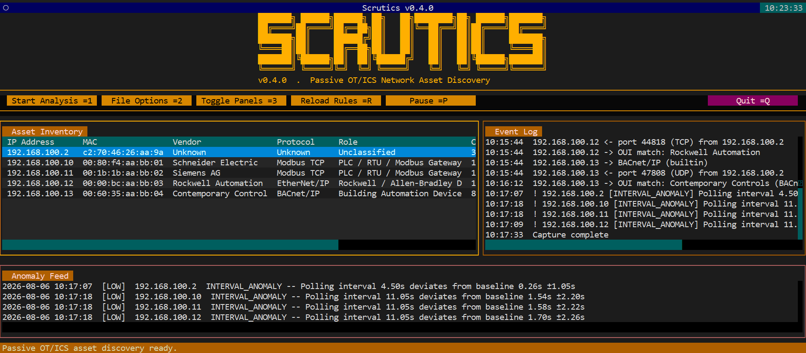
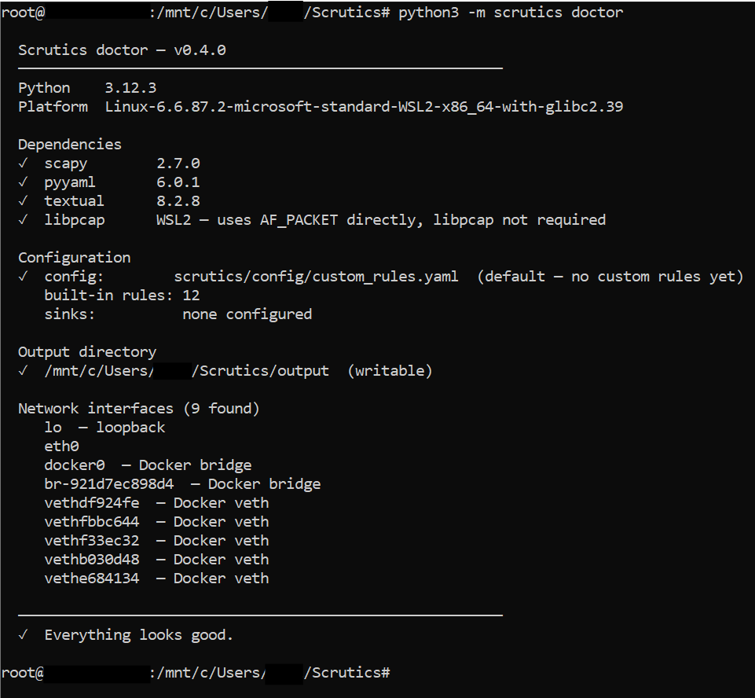
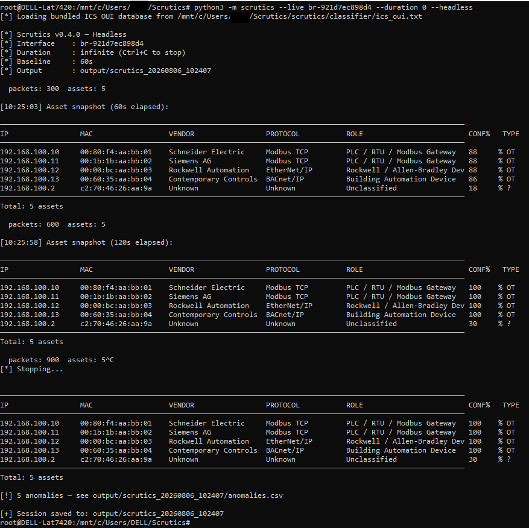
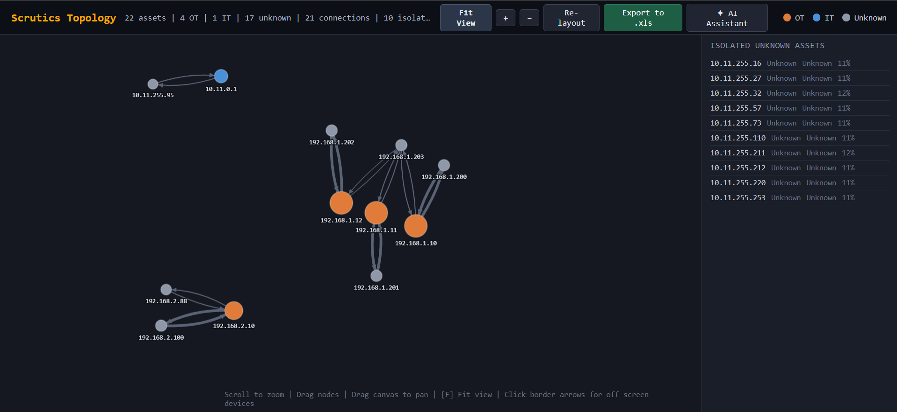
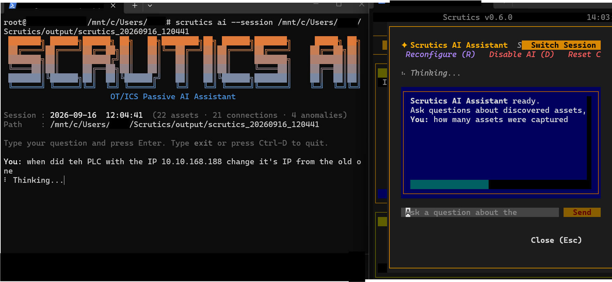
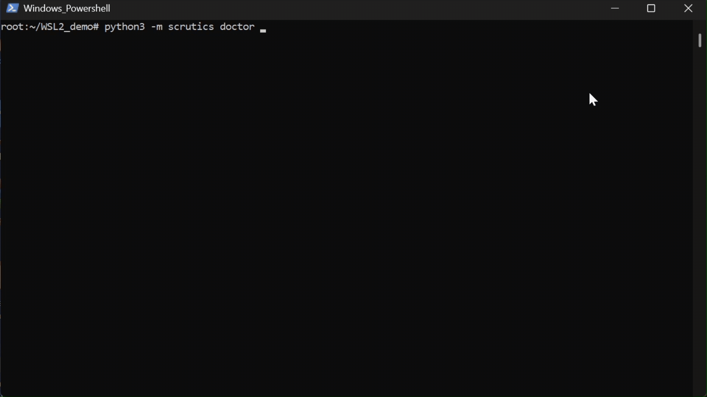

# Scrutics

**Passive OT/ICS network asset discovery : zero packet injection.**

[](https://opensource.org/licenses/MIT)
[](https://www.python.org/downloads/)



Scrutics discovers and classifies industrial assets (PLCs, RTUs, HMIs, field devices) by observing network traffic passively. It never transmits packets or actively interacts with monitored devices.

---

## Why passive?

Active scanning can disrupt sensitive or legacy OT devices, particularly in environments where devices were not designed to handle unexpected traffic. Scrutics operates exclusively in read-only mode: it listens to traffic already on the wire and classifies what it sees.

No probes. No injected packets. No active interaction with monitored devices.

Passive operation is enforced at runtime by patching Scapy’s transmit functions before capture starts. Any accidental transmit attempt raises a `PermissionError` and is logged.

---

## Features

- **Passive live discovery** : captures traffic from a network interface
- **PCAP / PCAPNG analysis** : works offline with existing packet captures
- **OT/ICS protocol classification** : identifies supported industrial protocols including Modbus TCP, S7comm, EtherNet/IP, DNP3, BACnet/IP, and others
- **Vendor identification** : MAC OUI lookup using the bundled OUI database
- **Behavioral baselining** : learns per-device communication patterns and detects anomalies (`NEW_PEER`, `DIRECTIONALITY_CHANGE`, `INTERVAL_ANOMALY`)
- **Custom behavioral rules** : constraints such as `never_initiates`, `allowed_peers`, `allowed_ports`, `max_new_peers_per_hour`
- **Interactive topology HTML** : force-directed graph with isolated-node side panel, drag, and zoom
- **Excel export (`.xlsx`)** : client-side export from the topology HTML (Assets, Connections, Summary)
- **SIEM forwarding** : syslog (JSON, CEF, LEEF, plain) and Splunk HEC
- **Zeek & Suricata log ingestion** : discover assets from existing Zeek and Suricata logs
- **Crash-safe checkpointing** : session data checkpointed every 15 seconds using atomic file replacement
- **AI assistant** : ask questions about captured sessions using natural language. Supports Gemini, OpenAI, Anthropic, and Ollama (local/offline)
- **MAC-based asset identity** : persistent device tracking by MAC address with IP history
- **Passive DHCP enrichment** : extracts hostname and vendor class from observed DHCPv4 traffic
- **OUI database management** : `scrutics oui status|update|import` with air-gapped workflow support

---

## Installation

**Recommended : virtual environment**

```bash
git clone https://github.com/AhmedQazafy/Scrutics-Lightweight-OT-ICS-asset-discovery-and-industrial-network-visibility-tool.git
cd Scrutics-Lightweight-OT-ICS-asset-discovery-and-industrial-network-visibility-tool
python3 -m venv .venv
source .venv/bin/activate
pip install -r requirements.txt
```

**Editable install** (development / contributors)

```bash
pip install -e .
scrutics --version
```

**Verify everything works**

```bash
python3 -m scrutics doctor
```

Doctor checks dependencies, interfaces, and configuration. If it reports that everything looks good, you’re ready.

> On externally-managed Python environments (some Debian/Ubuntu systems) you may need `--break-system-packages`. Prefer a virtual environment whenever possible.



---

## Quick start

**Launch the TUI** (recommended for first use)

```bash
sudo python3 -m scrutics
```

**Headless live capture**

```bash
sudo python3 -m scrutics --live <interface> --headless
```

**Analyze a PCAP file**

```bash
python3 -m scrutics --file capture.pcap --headless
```

**Fast inventory from a large PCAP** (skip anomaly detection)

```bash
python3 -m scrutics --file big.pcap --headless --no-baseline
```


*Headless live capture | periodic asset snapshots with confidence scores climbing as the baseline locks, then a clean save on Ctrl+C*

---

## Topology & Excel export

Scrutics generates an interactive HTML topology map:

- Force-directed layout
- Isolated unknown assets grouped in a side panel
- Labels hide when zoomed out to avoid clutter
- Drag nodes to adjust layout; scroll to zoom



### Export to Excel

The HTML topology includes an **Export to .xlsx** button that downloads a spreadsheet with three sheets:

- **Assets** : IP, MAC, vendor, protocol, role, confidence
- **Connections** : source, destination, protocol, packet count
- **Summary** : network statistics

The export is 100% client-side : no data is sent to any server. The SheetJS library is bundled locally so no internet connection is required.

> **Note:** Very large graphs may become slower to render.

---

## AI assistant

Scrutics includes an optional AI assistant that can answer questions about captured sessions using natural language.

**CLI**

```bash
python3 -m scrutics ask --session output/scrutics_20260914_120000
```

**TUI** : press the AI Assistant button in the toolbar.

**Supported providers** : Ollama (local, offline), Google Gemini, OpenAI, Anthropic. Configure via `scrutics/config/ai.yaml` or the built-in onboarding prompts.

The AI assistant only reads session data, it never modifies assets, injects packets, or writes to the network.

Note: AI assistant can be configured to run from a different server on the network. it works completely separately from Scrutics either way.


*AI Assitant in can be Run in both CLI and TUI, Topology HTML assitant is currently broken but will be fixed soon*

---

## Output files

All output is saved under `output/scrutics_TIMESTAMP/`.

| File              | When written             | Contents                                              |
|-------------------|--------------------------|-------------------------------------------------------|
| `assets.csv`      | Every 15s / session end  | IP, MAC, vendor, protocols, role, confidence, anomaly count |
| `events.csv`      | Every 15s / session end  | Classification events                                 |
| `anomalies.csv`   | Every 15s / session end  | Behavioral anomalies                                  |
| `connections.csv` | Every 15s / session end  | Source, destination, protocol, packet count           |
| `topology.json`   | Every 15s / session end  | Machine-readable graph data                           |
| `topology.html`   | Every 15s / session end  | Interactive topology map                              |

### Per-device limits

Each device keeps a bounded amount of history, so a flood from one host cannot grow its record
without limit. What is not kept is counted, and the counts are appended to `assets.csv` (0, or empty
for the breakdown, when nothing was dropped) and shown in the run summary:

| Kept per device | Limit | Count column in `assets.csv` |
|---|---|---|
| IP address history | the most recent 256 changes | `ip_history_dropped` |
| Evidence values of each kind (for example mDNS names, DHCP host names) | the first 64 distinct values | `evidence_overflow`, per kind in `evidence_overflow_by_type` |
| DNS names | the first 64 | `dns_names_overflow` |
| Peer addresses (`peer_count` is the number kept) | the first 4096 | `peer_additions_rejected`, every refused addition including repeats |
| First-contact times for `max_new_peers_per_hour` | the first 4096 peers | `peer_first_seen_overflow` |

A peer beyond the 4096th is not reported as a new peer by the behavioral baseline and does not count
toward `max_new_peers_per_hour`; it still appears in the topology.

---

## Configuration

Edit `scrutics/config/custom_rules.yaml` to add custom rules and SIEM sinks. Changes reload automatically while Scrutics is running. Press `R` in the TUI for an immediate reload.

The built-in ICS rules are in `scrutics/config/builtin_rules.yaml` : do not edit this file.

**Custom classification + behavioral rule**

```yaml
rules:
  - name: "Modbus PLC Fleet"
    port: 502
    classify_as: "Modbus TCP"
    role: "PLC / RTU"
    is_ot: true
    never_initiates: true
    allowed_peers:
      - "192.168.1.100"
    max_new_peers_per_hour: 2
```

**SIEM sink**

```yaml
output:
  sinks:
    - type: syslog
      host: 192.168.1.50
      port: 514
      protocol: udp
      format: json        # json | cef | leef | plain

    - type: splunk_hec
      url: "https://splunk.example.com:8088"
      token: "your-hec-token"
      verify_ssl: true
```

Classification fields: `name`, `port`, `mac_prefix`, `protocol`, `classify_as`, `role`, `is_ot`, `confidence`

Behavioral constraints: `never_initiates`, `allowed_peers`, `allowed_ports`, `alert_on_new_port`, `max_new_peers_per_hour`

---

## Deployment notes

**Finding the right interface**

```bash
python3 -m scrutics doctor
sudo tcpdump -i <interface> -c 10
```

If `tcpdump` shows no packets, the interface is wrong or the SPAN/mirror port is not configured.

**Windows users**

Live capture requires Linux or WSL2. Clone inside the WSL filesystem (not `/mnt/c/...`) or analyze offline PCAP files. Offline PCAP analysis does not require root privileges.

**Stopping a live capture**

Run live captures in the foreground so Ctrl+C can stop the capture cleanly:

```bash
sudo python3 -m scrutics --live <interface> --duration 0 --headless
# Ctrl+C stops the capture and flushes the current session data
```
---

### Example GIF

*Using Doctor then Headless live test then a save on Ctrl+C*

---

## Command reference

| Option               | Default    | Description                                      |
|----------------------|------------|--------------------------------------------------|
| `--live INTERFACE`   | :          | Network interface for live capture               |
| `--file FILEPATH`    | :          | File to analyze (`.pcap`, `.pcapng`, `.log`, `.json`) |
| `--duration SECONDS` | 60         | Capture duration. `0` = run until Ctrl+C         |
| `--baseline SECONDS` | 60         | Observation window before anomaly detection      |
| `--output DIR`       | `./output` | Output directory for session folders             |
| `--headless`         | off        | Run without the TUI                              |
| `--no-baseline`      | off        | Skip anomaly detection : inventory only          |
| `doctor`             | :          | Print diagnostic information                     |
| `ask`                | :          | Interactive AI assistant (alias: `ai`)           |
| `oui status`         | :          | Show OUI database status and freshness           |
| `oui update`         | :          | Download latest OUI database from IEEE            |
| `oui import FILE`    | :          | Import an offline OUI database file               |
| `list-models PROVIDER`| :         | List available models for a provider              |

**TUI shortcuts:** `1` Start · `2` File Options · `3` Toggle Panels · `R` Reload Rules · `P` Pause · `Q` Quit · `←→` Switch Panels · `Enter` Scroll Mode

---

## Troubleshooting

Run `python3 -m scrutics doctor` first : it identifies most issues.

| Symptom                 | Fix                                                                 |
|-------------------------|---------------------------------------------------------------------|
| No packets after 30 s   | Wrong interface : check doctor interface list                       |
| Permission denied       | `sudo python3 -m scrutics`                                          |
| `assets.csv` not saved  | Process was backgrounded : run in the foreground and use Ctrl+C     |
| Rules not reloading     | Check YAML syntax and run `scrutics doctor`; inspect console output |
| TUI won't open          | `pip install textual` (inside your virtual environment)             |

---

## Known limitations

- Large PCAPs may require more processing time and memory. Use `--no-baseline` when behavioral anomaly detection is not required.
- Memory grows with the number of distinct devices seen; there is no limit on the number of devices. Spoofed traffic that invents many MAC or IP addresses therefore grows memory without bound (about 8.8 KB per device, so about 880 MB per 100,000 invented devices). The history kept per device is bounded (see "Per-device limits"), but the behavioral baseline is kept per IP address, so one device that moves through many addresses still adds one baseline per address.
- No MAC addresses in Zeek/Suricata logs : OUI vendor matching unavailable; confidence scores are lower
- No IPv6 support
- WSL2 file performance : keep Scrutics on the Linux filesystem, not `/mnt/c/...`
- Very large topology graphs may become slower to render

---

## Why v0.x?

Scrutics stays in the 0.x series while validating its architecture through real-world deployments. Core capture and classification are functional and covered by the project’s test suite. Configuration format and internal APIs may change before v1.0.

---

## Roadmap

- Validate Wazuh and Splunk integrations in production environments
- Improve Windows and offline PCAP workflows
- Refine behavioral detection based on feedback from real OT environments
- Explore Gephi / Cytoscape import for advanced graph analysis
- Investigate standalone executable packaging

---

## Project structure

```text
Scrutics/
├── scrutics/
│   ├── baseline/       – behavioral baseline engine
│   ├── capture/        – packet capture and flow processing
│   ├── classifier/     – OUI lookup and protocol classification
│   ├── config/         – YAML rules (builtin_rules.yaml, custom_rules.yaml)
│   ├── db/             – asset inventory and rolling CSV writer
│   ├── diagnostics.py  – health checks (scrutics doctor)
│   ├── integrations/   – SIEM sink manager (syslog, Splunk HEC)
│   ├── parsers/        – Zeek, Suricata, PCAP parsers
│   ├── signals.py      – file-watch reload and SIGHUP handler
│   ├── ui/             – Textual TUI
│   └── passive.py      – passive enforcement layer
├── sim/                – Docker OT simulation (Modbus, EtherNet/IP, BACnet)
├── tests/              – test suite
└── pyproject.toml
```

## License

MIT
